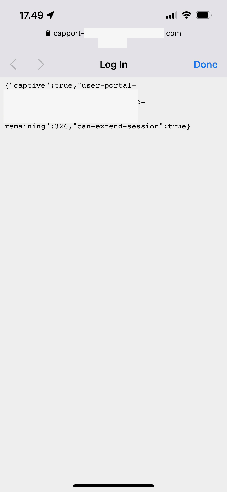

# CAPPORT API (RFC 8908) POC Implementation with Node.js

## Introduction

This repository contains documented efforts to build a proof-of-concept level
implementation of the modern CAPPORT API for Captive Portal functionality, as specified in
[RFC 8909](https://datatracker.ietf.org/doc/html/rfc8908).

The main purpose of this POC implementation is to enable testing different UE
implementations of the modern CAPPORT architecture. This implementation is
not intended to provide a fully featured captive portal system suitable for end
user deployment.

Planned features include dynamic captivity and other state management; improved
logging and monitoring for diagnostics use; and simple device authentication and
network policy enforcement mechanisms.

## Background

For general background on the efforts to modernize captive portal flow, see e.g.
["How to modernize your captive network", published by Apple in June 2020](https://developer.apple.com/news/?id=q78sq5rv).

## Usage

To use this POC API implementation, you need a suitable local (wireless) network
which has been configured accordingly. You can either use an existing network,
or provision e.g. a suitable Wi-Fi equipped Raspberry Pi device. Ensure that the
CAPPORT API server (and the User Portal URL, if not the same) is accessible by
local network devices; if hosting the API and/or User Portal page in the cloud,
you need to enable Internet routing for the local network.
Reference network setup to be documented.

You also need an instance of this API server, accessible from the local network.
Note that as per Section 4 of RFC 8908, the API server MUST be accessed using an
`https` URI, and SHOULD use the default `https` port. As such, implementations
can be expected to refuse to connect to an insecure API URI or without valid
certificate trust in place.

The local network should be setup to provide for dynamic CAPPORT API URI
discovery of the API server URI using one of the methods described in
[RFC 8910](https://datatracker.ietf.org/doc/html/rfc8910). If you are using
`dnsmasq` in particular to implement the IPv4 DHCP Option described in Section
2.1., you can use the following configuration entry in your `/etc/dnsmasq.conf`
file:

```
dhcp-option=114,https://<API server URI goes here>
```

To verify that the option is being correctly dispatched to DHCP protocol
clients, you can consult dnsmasq logs after joining the network with another
device:

```sh
journalctl -u dnsmasq.service -f
```

You can also use other standard networking diagnostics tools and/or operating
system logs to debug the captive portal flow. Detailed instructions depend on
the operating system in use; some example use cases to be documented later.

## Configuration

To configure the API server, set the following environment variables:

| Environment Variable | Description                                                                                                                                                                                                                  | Default (Example) Value                    |
| -------------------- | ---------------------------------------------------------------------------------------------------------------------------------------------------------------------------------------------------------------------------- | ------------------------------------------ |
| `PORT`               | Provides the TCP port which the server listens to                                                                                                                                                                            | 8080                                       |
| `USER_PORTAL_URL`    | Provides the URL of a web portal that MUST be accessed over TLS with which a user can interact.                                                                                                                              | `http://example.org/portal.html`           |
| `VENUE_INFO_URL`     | Provides the URL of a webpage or site that SHOULD be accessed over TLS on which the operator of the network has information that it wishes to share with the user (e.g., store info, maps, flight status, or entertainment). | `https://flight.example.com/entertainment` |

For details, see [Section 5 of RFC8908](https://datatracker.ietf.org/doc/html/rfc8908#section-5).

## Known UE Implementations

On iOS 15.5, accessing the local network opens the user portal URL in an
operating system "Captive Portal Mini-Browser" (CPMB) dialog, which is similar
to that of the legacy captive portal flow:



As currently implemented in iOS 15.5, the modern captive portal flow doesn't
seem to get triggered on the first network join, so you may need to leave the
network and rejoin it to see the popup.

As currently implemented in iOS 15.5, the operating system seems to treat any
network in a manner resembling the legacy "post-captive" state after opening
the CPMB. This is in contrast to the implementation in iOS 15.1, which shows the
"pre-captive" state instead. Details of this behavior to be documented.

Testing on other devices and operating systems to follow.

## Resources

For further details, consult materials published by the
[Captive Portal Integration WG (Concluded)](https://datatracker.ietf.org/wg/capport/about/).
